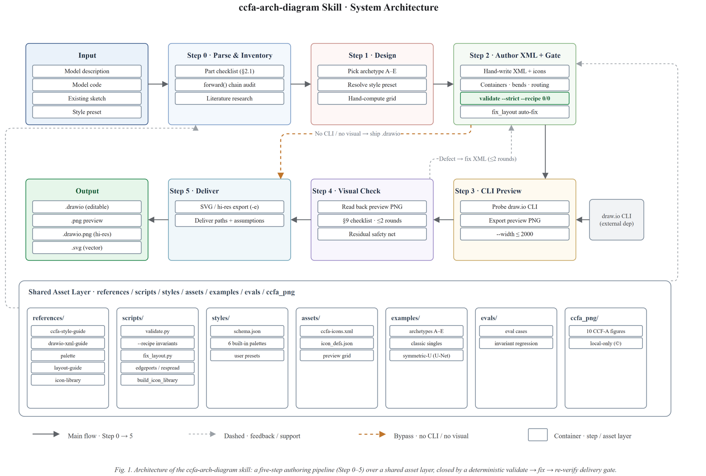

# ccfa-arch-diagram

**Generate publication-ready, CCF-A conference-grade model architecture diagrams as editable draw.io files.**

[](LICENSE)
[](https://github.com/jgraph/drawio-desktop)
[](https://github.com/jgraph/drawio-desktop)

`ccfa-arch-diagram` is a **Claude Code skill** that turns a natural-language description of a model — or its source code — into a clean, collision-free, publication-quality `.drawio` architecture diagram, styled like figures from top-tier venues (NeurIPS, ICML, ICLR, CVPR, ICCV, ACL, EMNLP, AAAI, KDD).

Every diagram is **hand-authored directly as editable draw.io XML** and rendered with the native draw.io desktop CLI — the output is a *real* diagram you can keep editing, not a one-off render.

> **Scope:** this skill specializes in **paper model-architecture figures**. For general diagrams (UML, ER, flowcharts, network topology, etc.), use [drawio-skill](https://github.com/Agents365-ai/drawio-skill).

---

## Sample Output



The skill's own architecture, drawn by the skill itself — editable source: [`examples/skill_architecture.drawio`](examples/skill_architecture.drawio).

---

## Table of Contents

- [Sample Output](#sample-output)
- [Features](#features)
- [Quick Start](#quick-start)
- [Usage](#usage)
- [The Five Archetypes](#the-five-archetypes)
- [Style Presets](#style-presets)
- [Project Structure](#project-structure)
- [Development & Contributing](#development--contributing)
- [Quality Assurance](#quality-assurance)
- [Dependencies](#dependencies)
- [License](#license)

## Features

- **Hand-authored draw.io XML** — every diagram is written directly as editable `.drawio` XML following a strict layout discipline (10-px grid, port slot formula, title-band clearance), so the result is a real, editable diagram.
- **Five proven archetypes** — pipeline-with-zoom, multi-panel training, multi-agent system, reasoning-stage containers, and framework bands cover the shapes that actually recur in CCF-A figures.
- **Deterministic structural validation** — `validate.py` lints for overlaps, crossings, title-band intrusions, port stacking, oversized canvases, and dangling edges *before* you export; `edgeports.py` / `respread_ports.py` auto-fix stacked ports.
- **Academic styling** — six built-in palettes, Times New Roman labels, translucent containers, op-circles, `×N` repetition markers, legends, and figure captions.
- **Personal style presets** — "use my `<name>` style", or teach it the palette from an existing figure; presets live in `~/.ccfa-arch-diagram/styles/`.

## Quick Start

**Prerequisites:** [draw.io desktop](https://github.com/jgraph/drawio-desktop/releases) (needed for PNG/SVG export; the `.drawio` file itself can be produced without it) and optionally Python 3 (stdlib only) for structural validation.

### 1. Install the skill

**Global** (available in every project):

```bash
mkdir -p ~/.claude/skills/ccfa-arch-diagram
cp -r SKILL.md README.md LICENSE references scripts styles examples evals ~/.claude/skills/ccfa-arch-diagram/
```

**Project-scoped** (this repository only):

```bash
mkdir -p .claude/skills/ccfa-arch-diagram
cp -r SKILL.md README.md LICENSE references scripts styles examples evals .claude/skills/ccfa-arch-diagram/
```

Restart Claude Code (or start a new session). The skill then **auto-triggers** whenever you describe a model you want diagrammed, or you can invoke it directly with `/ccfa-arch-diagram`.

### 2. Use it

Describe your model in plain words:

> Draw an architecture diagram of my diffusion transformer: U-Net backbone, 12 blocks with cross-attention, residual connections, a timestep embedding on the side, and a 3-head output head for noise/variance/prediction.

…or paste your PyTorch/TensorFlow model code, or point it at an existing rough sketch. The skill produces:

1. `<name>.drawio` — the editable diagram (primary deliverable)
2. `<name>.png` / `<name>.svg` — rendered preview and vector export

## The Five Archetypes

Different model families map to different figure shapes. The skill picks the right one and follows its recipe:

| Archetype | Best for | Example |
|---|---|---|
| **A · Pipeline + zoom** | Single network backbones (CNN / Transformer / ViT / super-resolution) | [`examples/pipeline_zoom.drawio`](examples/pipeline_zoom.drawio) |
| **B · Multi-panel training** | Training pipelines / continual learning ((a)(b)(c) subfigures) | [`examples/multipanel_train.drawio`](examples/multipanel_train.drawio) |
| **C · System partition** | Multi-agent / RAG / LLM systems (2×2 panels + heavy arrows) | [`examples/agent_panels.drawio`](examples/agent_panels.drawio) |
| **D · Reasoning stages** | CoT / reasoning chains (stage containers + step notes) | [`examples/reasoning_stages.drawio`](examples/reasoning_stages.drawio) |
| **E · Framework bands** | Multimodal LLMs / unified frameworks (dark header bands) | [`examples/framework_bands.drawio`](examples/framework_bands.drawio) |

Classic single-figure references: [`examples/transformer_mt.drawio`](examples/transformer_mt.drawio), [`examples/vit.drawio`](examples/vit.drawio), [`examples/diffusion.drawio`](examples/diffusion.drawio).

Every example is a validated, hand-authored `.drawio` file — open it in draw.io and use it as a template.

## Style Presets

The skill ships with 6 built-in palettes in [`styles/built-in/`](styles/built-in/):

`ccfa-standard` (default) · `academic-blue` · `print-grayscale` · `neural-purple` · `vision-green` · `warm-paper`

| You say | What happens |
|---|---|
| "use my `<name>` style" | Reads `~/.ccfa-arch-diagram/styles/<name>.json`, applies its fill/stroke/text values |
| "learn the palette from this figure, save as `<name>`" | Extracts the colors and writes a personal preset |
| "recolor `<name>.drawio` into `<preset>`" | Rewrites fill/stroke/font colors per kind, layout untouched |
| "list the available styles" | Prints the built-in and personal presets |

The preset format is documented in [`styles/schema.json`](styles/schema.json).

## Project Structure

```
ccfa-arch-diagram/
├── SKILL.md                  # Main skill instructions (the workflow Claude follows)
├── references/               # In-depth guides (style guide, XML reference, palette, layout)
├── scripts/                  # Deterministic lint & port-fix tools (pure Python stdlib)
├── styles/                   # Style-preset schema + 6 built-in palettes
├── examples/                 # Validated .drawio archetype examples (use as templates)
├── evals/                    # Test cases / eval harness
└── LICENSE                   # MIT
```

> Reference figures from published papers (`ccfa_png/` in the working copy) are kept **local-only** for copyright reasons and are excluded from this repository.

## Development & Contributing

Contributions are welcome! The most useful contributions for a research-tooling skill tend to be:

- **New archetypes** — a diagram shape that recurs in top-venue figures but isn't covered yet.
- **Validation rules** — `scripts/validate.py` catches layout defects deterministically; new heuristics are highly valuable.
- **Palettes & presets** — more built-in palettes, or example presets.
- **Eval cases** — realistic model descriptions that stress the skill (in `evals/`).

**Working on it:**

1. Fork the repository and create a feature branch.
2. [`SKILL.md`](SKILL.md) is the source of truth — read [`references/drawio-xml-guide.md`](references/drawio-xml-guide.md) before touching diagram generation.
3. Any layout change **must** pass `scripts/validate.py` (zero errors) plus a visual self-check of the exported PNG.
4. Run the eval suite in [`evals/`](evals/) before opening a pull request.
5. Open a PR with a clear description of the problem and a before/after comparison.

**Code of conduct:** be respectful, cite your sources, and preserve the attribution/license headers of the projects this skill builds on.

## Quality Assurance

- **Completeness** — input is graded by type: with model code, every module along the `forward()` chain is registered; with a vague description, authoritative sources (paper / official docs / arXiv) are consulted first; when nothing authoritative exists, the skill draws the nearest well-known architecture and clearly marks the assumptions for review.
- **No overlap, no crossings** — hand-computed layout discipline (grid, margins, port slot formula) + `scripts/validate.py` deterministic lint + visual self-check (≤2 fix rounds).
- **Aesthetics** — archetype recipes + density floor (minimum components/edges) + academic palettes + top-venue finishing (Times New Roman, translucent containers, captions, legends).

## Dependencies

- **draw.io desktop** — required for PNG/SVG preview and export: [drawio-desktop releases](https://github.com/jgraph/drawio-desktop/releases), or the web app at [app.diagrams.net](https://app.diagrams.net). The `.drawio` file itself can be produced without it.
- **Python 3** (optional, stdlib only) — runs `scripts/validate.py`, `edgeports.py`, `respread_ports.py`.
- **A vision-capable model** — used for the visual self-check step.

## License

[MIT](LICENSE) © 2026 luesther655-dotcom
